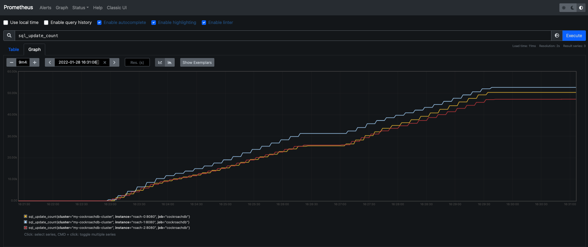

Prometheus monitoring of a secured cluster via https://www.cockroachlabs.com/docs/stable/monitor-cockroachdb-with-prometheus.html

Simple 3 node *secure* CockroachDB cluster with HAProxy acting as load balancer

* UPDATED: 11/11/20

Prerequisites:

## Services
* `roach-0` - CockroachDB node
* `roach-1` - CockroachDB node
* `roach-2` - CockroachDB node
* `lb` - HAProxy acting as load balancer
* `roach-cert` - Holds certificates as volume mounts

## Getting started
>If you are using Google Chrome as your browser, you may want to navigate here `chrome://flags/#allow-insecure-localhost` and set this flag to `Enabled`.

1) because operation order is important, execute `./up.sh` instead of `docker compose up`
   - monitor the status of services via `docker-compose logs`
2) `docker compose ps`
3) visit the CockroachDB [Admin UI](https://localhost:8080) and login with username `test` and password `password`
4) visit the [HAProxy UI](http://localhost:8081)

### Open Interactive Shells
```bash
docker exec -ti roach-0 /bin/bash
docker exec -ti roach-1 /bin/bash
docker exec -ti roach-2 /bin/bash
docker exec -ti lb /bin/sh

# shell
docker exec -ti roach-cert /bin/sh

# cli inside the container
cockroach sql --certs-dir=/certs --host=lb

# directly
docker exec -ti roach-0 cockroach sql --certs-dir=/certs --host=lb
```

access [HAProxy](http://localhost:8081)


run a workload on the client container

```bash
cockroach workload init tpcc 'postgresql://root@roach-0:26257/tpcc?sslcert=%2Fcerts%2Fclient.root.crt&sslkey=%2Fcerts%2Fclient.root.key&sslmode=verify-full&sslrootcert=%2Fcerts%2Fca.crt'

cockroach workload run tpcc --duration=1h 'postgresql://root@lb:26257/tpcc?sslcert=%2Fcerts%2Fclient.root.crt&sslkey=%2Fcerts%2Fclient.root.key&sslmode=verify-full&sslrootcert=%2Fcerts%2Fca.crt'
```

open Prometheus at http://localhost:9090

search a metric like `sql_update_count` and watch the Prometheus graph



__NOTE:__ Alert Manager alerts are not correct, TestAlert is not firing

Grafana configuration is manual, for datasource, you must use the container hostname of the Prometheus container, i.e. http://prometheus:9090, not localhost.
